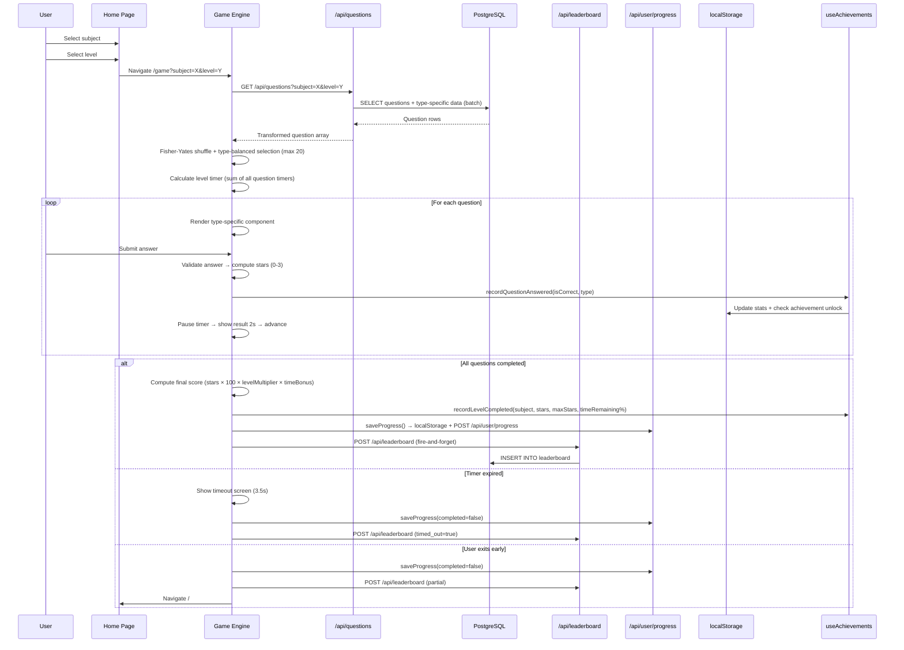
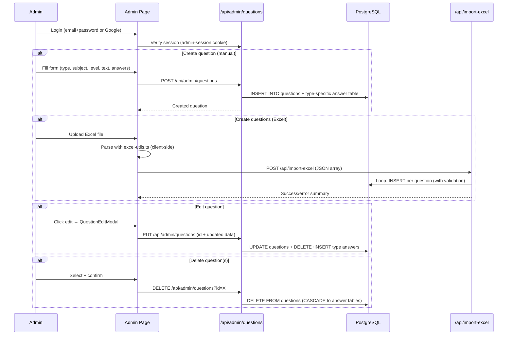
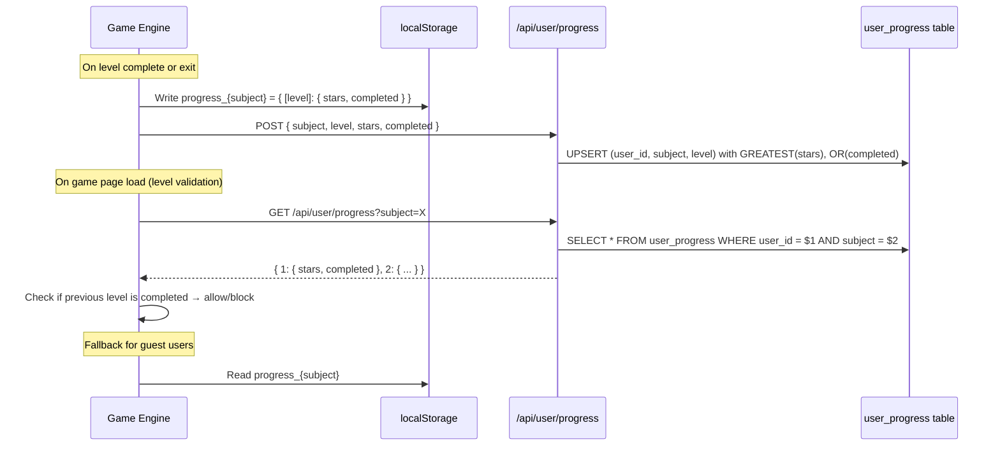
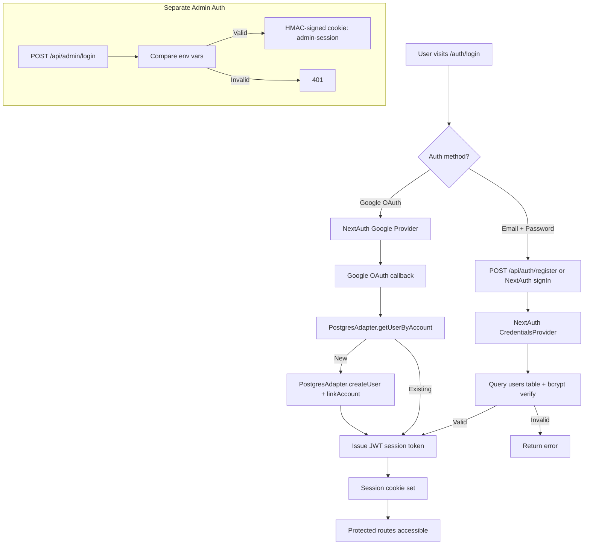

# Mauritius Learning Hub — Feature & Flow Audit

> **Audit date:** 2026-07-16  
> **Auditor:** Automated Senior Architect Discovery  
> **Scope:** Read-only analysis; zero code changes  

---

## 1. Executive Summary

The **Mauritius Learning Hub** is a Next.js 14 (App Router) educational game platform that teaches students about the history and geography of Mauritius. The frontend is a rich, kid-themed SPA; the backend is a PostgreSQL database on Render, accessed via a raw `pg` connection pool. Authentication is handled by NextAuth.js (JWT strategy) with Credentials + Google OAuth providers.

**Key architectural facts:**
- **5 question types** (MCQ, matching, fill-in-blanks, reorder, true/false) each backed by a dedicated DB answer table and a dedicated React game component.
- **Two parallel auth systems:** NextAuth for student users, and a separate env-var-based admin auth with HMAC-signed session cookies.
- **Dual persistence for progress:** `localStorage` (offline-first, always written) + `user_progress` DB table (synced when authenticated).
- **Achievements & streaks** are entirely client-side (localStorage only) — they are invisible to the admin dashboard.
- Scoring uses a multi-factor formula: `baseStars × POINTS_PER_STAR × levelMultiplier × timeBonus`.
- The admin panel is a monolithic 1 586-line single-page component with question CRUD, bulk Excel import, user management, and inline editing.

---

## 2. User-Side Feature Inventory

| # | Feature | Purpose | Key Files / Routes | Dependencies |
|---|---------|---------|-------------------|--------------|
| 1 | **Home / Subject Selection** | Landing page; pick History, Geography, or Combined | `app/page.tsx` | `next-auth/react`, `ProgressMap`, `DodoMascot` |
| 2 | **Level Selection** | Choose difficulty (1–3) for chosen subject | `app/page.tsx` (inline sub-view) | Reads `progress_{subject}` from localStorage or `/api/user/progress` |
| 3 | **Progress Map** | Visual adventure-map showing level unlock state | `components/progress-map.tsx` | `/api/user/progress` (GET), localStorage fallback |
| 4 | **Game Engine** | Core quiz loop: loads questions, renders per-type game, scores, times out | `app/game/page.tsx`, `app/game/layout.tsx` | `use-questions` hook → `/api/questions`, `game-config`, `use-achievements`, `use-game-sounds`, `progress-map.saveProgress`, `/api/leaderboard` (POST) |
| 5 | **MCQ Game** | Multiple-choice question renderer + answer validation | `components/multiple-choice-game.tsx` | `game-confetti`, `dodo-mascot`, `use-game-sounds` |
| 6 | **Matching Game** | Drag/click-to-match pairs | `components/matching-game.tsx` | Same UI dependencies as MCQ |
| 7 | **Fill-in-Blanks Game** | Text input with case-insensitive answer comparison | `components/fill-in-blanks-game.tsx` | Same UI dependencies |
| 8 | **Reorder Game** | Drag-to-reorder items | `components/reorder-game.tsx` | Same UI dependencies |
| 9 | **True/False Game** | Binary answer with explanation reveal | `components/true-false-game.tsx` | Same UI dependencies |
| 10 | **Leaderboard** | Public ranking with cumulated & per-level views, search, sort, pagination | `app/leaderboard/page.tsx` | `/api/leaderboard` (GET), `swr`, `next-auth/react` |
| 11 | **My Progress (History)** | Personal attempt history with SVG line chart, bar chart, summary stats | `app/history/page.tsx` | `/api/attempts` (GET) |
| 12 | **Explore Map** | Interactive SVG maps of Mauritius & Rodrigues with geographic features | `app/explore-map/page.tsx` | `lib/mauritius-map-data`, `lib/mauritius-features-data`, `lib/rodrigues-*-data` |
| 13 | **Authentication** | Sign-up, login, forgot/reset password, Google OAuth callback | `app/auth/login/page.tsx`, `app/auth/sign-up/page.tsx`, `app/auth/forgot-password/`, `app/auth/callback/` | `/api/auth/[...nextauth]`, `/api/auth/register`, `/api/auth/forgot-password`, `/api/auth/reset-password` |
| 14 | **Achievements & Badges** | Client-side achievement system with 18 unlockable badges (4 rarity tiers) | `hooks/use-achievements.ts`, `components/achievement-badge.tsx` | localStorage (`mauritius_game_achievements`, `mauritius_game_stats`) |
| 15 | **Streak Counter** | Visual streak indicator with multiplier display (≥ 3 correct streak) | `components/streak-counter.tsx` | Receives `currentStreak` prop from parent |
| 16 | **Sound System** | Game sounds (correct, wrong, star, level-complete) with mute toggle | `hooks/use-game-sounds.ts`, `components/sound-toggle.tsx` | Web Audio / `speechSynthesis` API |
| 17 | **Dodo Mascot** | Animated SVG mascot with context-sensitive speech bubbles | `components/dodo-mascot.tsx` | Pure React component; no external deps |
| 18 | **Dodo Timer** | SVG circular countdown timer with dodo animation | `components/dodo-timer.tsx` | Receives time props from game page |

---

## 3. Admin-Side Feature Inventory

| # | Feature | Purpose | Key Files / Routes | Dependencies |
|---|---------|---------|-------------------|--------------|
| 1 | **Admin Login** | Email/password login (env-var based), Google OAuth for admin | `components/admin-login-modal.tsx`, `/api/admin/login` (POST/GET/DELETE), `app/admin/google-auth/route.ts` | `lib/admin-auth.ts` (HMAC token), `lib/rate-limit.ts` |
| 2 | **Question Management (CRUD)** | Create, edit, delete questions across all types/subjects/levels | `app/admin/page.tsx` (lines 262–689), `components/question-edit-modal.tsx` | `/api/admin/questions` (GET/POST/PUT/DELETE) |
| 3 | **Question Table View** | Filterable, searchable table of all questions with bulk select | `app/admin/page.tsx` (lines 761–1586) | Client-side filtering on `allQuestions` state |
| 4 | **Bulk Delete** | Multi-select + bulk delete questions | `app/admin/page.tsx` (`handleBulkDelete`) | Sequential DELETE calls to `/api/admin/questions` |
| 5 | **Excel Import** | Upload Excel spreadsheet to batch-create questions | `components/excel-import-section.tsx`, `/api/import-excel` (POST) | `lib/excel-utils.ts` for client-side parsing, admin auth |
| 6 | **Image Upload** | Upload question images to server disk | `/api/upload-image` (POST/DELETE), `/api/images/[id]` (GET) | `lib/admin-auth.ts`, filesystem (Render persistent disk) |
| 7 | **User Management** | List all registered users, create users, delete users, reset passwords | `app/admin/page.tsx` (user management tab), `/api/admin/users` (GET/POST/DELETE/PATCH) | `lib/auth-utils.ts` (password hashing), `users` table |
| 8 | **Admin Session Verification** | Verify admin session on page load and API calls | `lib/admin-auth.ts` | `ADMIN_SESSION_SECRET` / `NEXTAUTH_SECRET` env vars |
| 9 | **Reference Data APIs** | Read-only endpoints for subjects, levels, question-types | `/api/admin/subjects`, `/api/admin/levels`, `/api/admin/question-types` | `subjects`, `levels`, `question_types` tables |

---

## 4. Cross-Feature Flow Diagrams

### 4.1 Core Game Flow

### 4.2 Admin Question Management Flow

### 4.3 Progress & Level Unlocking Flow

### 4.4 Authentication Flow

---

## 5. Algorithms Inventory

### 5.1 Question Selection & Randomization
| Property | Detail |
|----------|--------|
| **Name** | Type-balanced Fisher-Yates selection |
| **Purpose** | Select up to `QUESTIONS_PER_LEVEL` (20) questions with even representation across all available question types |
| **Location** | [game/page.tsx](file:///c:/Users/Abdallah%20Peerally/Desktop/his%20geo/history-of-mauritius-game%20v07012026/app/game/page.tsx#L240-L280) |
| **Algorithm** | 1. Group all questions by type. 2. Shuffle each group (Fisher-Yates). 3. Round-robin across shuffled type list to pick one per type until limit reached or all exhausted. 4. Final Fisher-Yates shuffle of selected set. |
| **Inputs** | All questions for a subject+level from DB |
| **Outputs** | `mixedQuestions[]` — a shuffled, type-balanced subset of ≤ 20 questions |

### 5.2 Scoring Formula
| Property | Detail |
|----------|--------|
| **Name** | Multi-factor score computation |
| **Purpose** | Calculate final leaderboard points from stars, level, and time remaining |
| **Location** | [game/page.tsx](file:///c:/Users/Abdallah%20Peerally/Desktop/his%20geo/history-of-mauritius-game%20v07012026/app/game/page.tsx#L476-L484) and [game-config.ts](file:///c:/Users/Abdallah%20Peerally/Desktop/his%20geo/history-of-mauritius-game%20v07012026/lib/game-config.ts) |
| **Formula** | `totalPoints = round(totalStars × POINTS_PER_STAR × LEVEL_MULTIPLIER[level] × (1 + timeRemainingFraction × TIME_BONUS_MAX_PERCENT / 100))` |
| **Constants** | `POINTS_PER_STAR = 100`, `LEVEL_MULTIPLIERS = {1: 1.0, 2: 1.5, 3: 2.0}`, `TIME_BONUS_MAX_PERCENT = 50` |
| **Inputs** | `totalStars` (0–60), `level` (1–3), `levelTimeLeft`, `levelInitialTime` |
| **Outputs** | Integer `total_points` posted to `/api/leaderboard` |

### 5.3 Per-Question Star Award
| Property | Detail |
|----------|--------|
| **Name** | Binary star award per question |
| **Purpose** | Each game component awards stars based on correctness |
| **Location** | Each game component (e.g., [multiple-choice-game.tsx](file:///c:/Users/Abdallah%20Peerally/Desktop/his%20geo/history-of-mauritius-game%20v07012026/components/multiple-choice-game.tsx), [matching-game.tsx](file:///c:/Users/Abdallah%20Peerally/Desktop/his%20geo/history-of-mauritius-game%20v07012026/components/matching-game.tsx)) |
| **Logic** | Correct = 3 stars, Wrong = 0 stars (MCQ). Matching game awards stars proportionally to pairs matched. Fill-in-blanks and true/false: 3 for correct, 0 for wrong. Reorder: stars based on correctly-positioned items. |
| **Inputs** | User answer vs. correct answer |
| **Outputs** | Integer stars (0–3) passed to `onComplete(stars)` callback |

### 5.4 Level Timer Calculation
| Property | Detail |
|----------|--------|
| **Name** | Aggregate level timer |
| **Purpose** | Set a single countdown for the entire level, not per-question |
| **Location** | [game/page.tsx](file:///c:/Users/Abdallah%20Peerally/Desktop/his%20geo/history-of-mauritius-game%20v07012026/app/game/page.tsx#L296-L345) |
| **Algorithm** | `totalTime = sum(q.timer || DEFAULT_QUESTION_TIMER for q in mixedQuestions)`. Default = 30s per question. Timer pauses during result display (2s per question). |
| **Inputs** | `mixedQuestions[].timer`, `GAME_CONFIG.DEFAULT_QUESTION_TIMER` |
| **Outputs** | `levelTimeLeft` state, `showTimeoutScreen` on expiry |

### 5.5 Level Unlock Validation
| Property | Detail |
|----------|--------|
| **Name** | Sequential level gate |
| **Purpose** | Prevent access to Level N unless Level N-1 is completed |
| **Location** | [game/page.tsx](file:///c:/Users/Abdallah%20Peerally/Desktop/his%20geo/history-of-mauritius-game%20v07012026/app/game/page.tsx#L164-L214) |
| **Algorithm** | Level 1 always unlocked. For level N > 1: load progress (DB → localStorage fallback), check `progress[N-1].completed === true`. |
| **Inputs** | `user_progress` table or `progress_{subject}` localStorage |
| **Outputs** | `levelUnlocked` boolean, `unlockError` message string |

### 5.6 Leaderboard Ranking
| Property | Detail |
|----------|--------|
| **Name** | Cumulated and per-level ranking |
| **Purpose** | Rank players by best scores across levels or per-level |
| **Location** | [/api/leaderboard/route.ts](file:///c:/Users/Abdallah%20Peerally/Desktop/his%20geo/history-of-mauritius-game%20v07012026/app/api/leaderboard/route.ts) |
| **Cumulated** | CTE: `GROUP BY player_name, user_id, subject` → `SUM(total_points)`, `SUM(stars_earned)`, `COUNT(DISTINCT level_id)`. Ordered by cumulated total_points DESC. |
| **Per-level** | `DISTINCT ON (player_name, subject_id, level_id)` → keeps only best score per player per level per subject. Ordered by total_points DESC. |
| **Inputs** | `leaderboard` table rows joined with `subjects` and `levels` |
| **Outputs** | Paginated JSON with `data[]`, `total`, `page`, `limit` |

### 5.7 Achievement System
| Property | Detail |
|----------|--------|
| **Name** | Client-side achievement engine |
| **Purpose** | Track and unlock 18 achievements across 4 categories |
| **Location** | [hooks/use-achievements.ts](file:///c:/Users/Abdallah%20Peerally/Desktop/his%20geo/history-of-mauritius-game%20v07012026/hooks/use-achievements.ts) |
| **Algorithm** | On each `recordQuestionAnswered` / `recordLevelCompleted` / `recordGameStarted`: update stats → iterate all achievement definitions → check `progress >= requirement` → unlock if newly met. |
| **Categories** | Progress (questions answered, levels completed), Performance (perfect scores, speed runs, star counts), Special (games played, types explored, consecutive days), Meta (unlock all others) |
| **Storage** | `localStorage` keys: `mauritius_game_stats`, `mauritius_game_achievements` |

### 5.8 Streak Multiplier (UI-only)
| Property | Detail |
|----------|--------|
| **Name** | Streak display multiplier |
| **Purpose** | Visual reward for consecutive correct answers |
| **Location** | [components/streak-counter.tsx](file:///c:/Users/Abdallah%20Peerally/Desktop/his%20geo/history-of-mauritius-game%20v07012026/components/streak-counter.tsx#L30-L36) |
| **Algorithm** | ≥ 10 correct → 3.0×, ≥ 7 → 2.5×, ≥ 5 → 2.0×, ≥ 3 → 1.5×, else 1.0× |
| **Note** | This multiplier is **display-only** — it does NOT affect the actual score saved to the leaderboard. |

### 5.9 Progress Persistence (Dual-Write)
| Property | Detail |
|----------|--------|
| **Name** | Dual-write progress sync |
| **Purpose** | Ensure progress is never lost, even offline |
| **Location** | [components/progress-map.tsx `saveProgress()`](file:///c:/Users/Abdallah%20Peerally/Desktop/his%20geo/history-of-mauritius-game%20v07012026/components/progress-map.tsx#L308-L340) |
| **Algorithm** | 1. Always write to `localStorage` with `Math.max(existingStars, newStars)` and `OR(existingCompleted, newCompleted)`. 2. If `userId` exists, POST to `/api/user/progress` which performs an UPSERT with same `GREATEST(stars)` and `OR(completed)` logic. |

### 5.10 MCQ Option Shuffling
| Property | Detail |
|----------|--------|
| **Name** | Per-question option randomization |
| **Purpose** | Prevent memorizing answer positions |
| **Location** | [components/multiple-choice-game.tsx](file:///c:/Users/Abdallah%20Peerally/Desktop/his%20geo/history-of-mauritius-game%20v07012026/components/multiple-choice-game.tsx#L96-L130) |
| **Algorithm** | Build index array [0,1,2,3], Fisher-Yates shuffle it, remap options and correct answer index accordingly. Memoized via `useMemo` keyed on `singleQuestion`. |

---

## 6. Shared Services & Tables

### 6.1 Shared Database Tables

| Table | Used By | Purpose |
|-------|---------|---------|
| `questions` | Game API, Admin CRUD, Excel Import | Central question store; FK to subjects, levels, question_types |
| `mcq_options` | Game API, Admin CRUD | MCQ answer options (cascades from questions) |
| `matching_pairs` | Game API, Admin CRUD | Matching pair data |
| `fill_answers` | Game API, Admin CRUD | Fill-in-blanks correct answers |
| `reorder_items` | Game API, Admin CRUD | Reorder correct positions |
| `truefalse_answers` | Game API, Admin CRUD | True/false correct answer + explanation |
| `subjects` | Game API, Leaderboard, Admin, Import | Reference table (history, geography, combined) |
| `levels` | Game API, Leaderboard, Admin, Import | Reference table (1, 2, 3) |
| `question_types` | Game API, Admin | Reference table (mcq, matching, fill, reorder, truefalse) |
| `leaderboard` | Game (POST), Leaderboard page (GET), History/Attempts (GET), Admin Users (last_seen) | Score records per player+subject+level |
| `users` | NextAuth, Admin user management, Progress, Leaderboard | User accounts |
| `accounts` | NextAuth (OAuth), Admin Users (provider display) | OAuth provider links |
| `sessions` | NextAuth | Session management |
| `user_progress` | Progress API, Game (level unlock validation), Progress Map, Admin Users (last_seen) | Per-user per-subject per-level stars/completion |

### 6.2 Shared Services / Utilities

| Service | File | Consumers |
|---------|------|-----------|
| **DB Pool** | `lib/db.ts` | Every API route; raw `pool.query()` pattern |
| **Auth Config** | `lib/auth.ts` | NextAuth route, all session-protected APIs |
| **Admin Auth** | `lib/admin-auth.ts` | All `/api/admin/*` routes, `/api/import-excel`, `/api/upload-image` |
| **Game Config** | `lib/game-config.ts` | Game page (scoring), completion screen |
| **Rate Limiter** | `lib/rate-limit.ts` | Admin login API |
| **XSS Protection** | `lib/xss-protection.ts` | (Available but usage not observed in main routes) |
| **CSRF Protection** | `lib/csrf-protection.ts` | (Available; middleware uses origin-based checks directly) |
| **Auth Utilities** | `lib/auth-utils.ts` | Password hashing/verification (bcrypt via `crypto`) |
| **Excel Utilities** | `lib/excel-utils.ts` | Excel import section component (client-side parsing) |

### 6.3 Shared localStorage Keys

| Key | Writers | Readers |
|-----|---------|---------|
| `progress_{subject}` | `saveProgress()` in game | `ProgressMap`, game level validation |
| `mauritius_game_stats` | `useAchievements` hook | `useAchievements` hook |
| `mauritius_game_achievements` | `useAchievements` hook | `useAchievements` hook |
| `adminUser` | Admin login flow | Admin page session check |
| `game_muted` | `SoundToggle` | `useGameSounds`, `isGameMuted()` |

---

## 7. Coupling Analysis & Architectural Notes

### 7.1 Tight Coupling

| Concern | Details |
|---------|---------|
| **Admin page monolith** | `app/admin/page.tsx` (1 586 lines) contains question CRUD, user management, Excel import orchestration, and all UI. Splitting this into sub-routes or components would reduce cognitive load. |
| **`saveProgress()` in `components/progress-map.tsx`** | The `saveProgress()` function (a side-effectful async function) is **exported from a UI component file**. It's called by `app/game/page.tsx`, creating a hidden dependency. Should be in `lib/` or a dedicated service. |
| **Game page → Leaderboard API** | The game page directly constructs the scoring formula and POSTs the result. The server blindly trusts the submitted `total_points` (within a cap of 15 000). A server-side recalculation from stars + level + time would be more secure. |
| **Dual auth systems** | Student auth (NextAuth JWT) and admin auth (custom HMAC cookies) are completely independent. An admin is **not** required to be a registered user. This is intentional but increases surface area. |

### 7.2 Hidden Dependencies

| Dependency | Risk |
|------------|------|
| **Streak counter multiplier is display-only** | The `StreakCounter` component shows multipliers (1.5×–3.0×) but they never affect the actual score. If anyone later assumes they do, scores will be miscalculated. |
| **Achievements are localStorage-only** | Achievements are invisible server-side. If a user clears browser data or switches devices, all achievement progress is lost. There is no admin visibility into achievements. |
| **`combined` subject** | The "combined" subject in the questions API pulls from both `history` and `geography` rows (`WHERE s.name IN ('history', 'geography')`), but there is also a `combined` row in the `subjects` table. Questions tagged as `combined` subject would need to be fetched differently from questions sourced across history + geography. |
| **`created_by` constraint** | The import API restricts `createdBy` to `"MES"` or `"MIE"` (hard-coded), but the admin CRUD API accepts any `created_by` string. |

### 7.3 Impact Assessment for New Module Addition

To add a new feature module (e.g., a new question type, a new subject, or a new game mode), the following shared resources would need updates:

1. **DB Schema** — New answer table (if new question type) or new `subjects`/`question_types` row
2. **`/api/questions` route** — Add batch-fetch and transform logic for the new type
3. **`/api/admin/questions` route** — Add validation, INSERT, UPDATE, DELETE logic for the new type
4. **`/api/import-excel` route** — Add parsing rules for the new type's Excel columns
5. **`app/game/page.tsx`** — Add dynamic import and `renderQuestion()` case for the new component
6. **`app/admin/page.tsx`** — Add form fields and `buildAnswerData()` logic for the new type
7. **`lib/game-config.ts`** — If scoring rules change
8. **`GAME_CONFIG.QUESTIONS_PER_LEVEL`** — May need adjustment

---

*End of audit. No code was modified. No deployments were triggered.*
